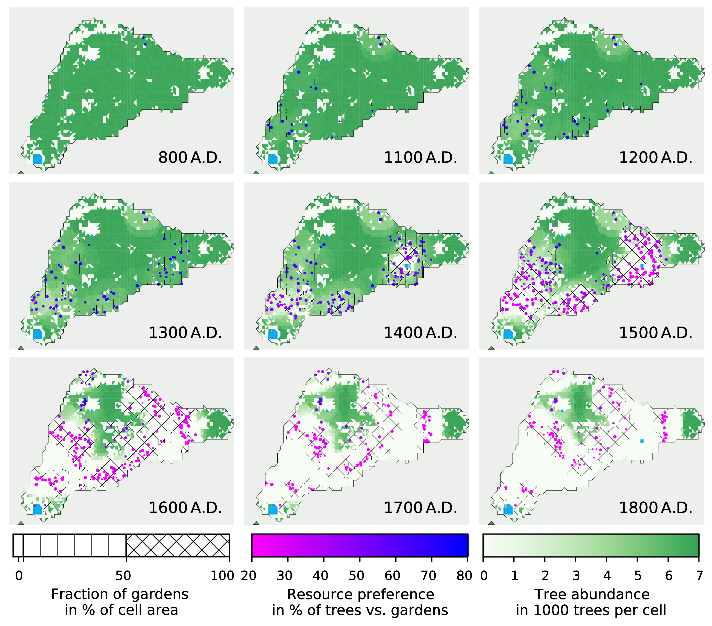
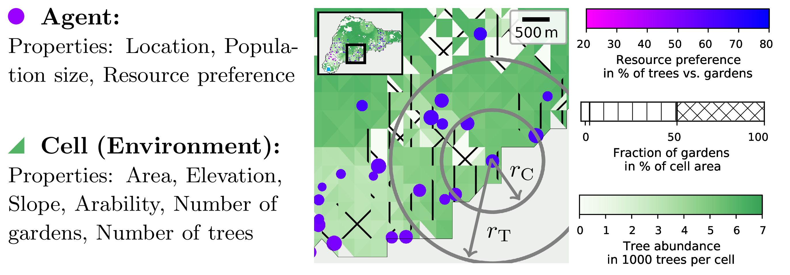
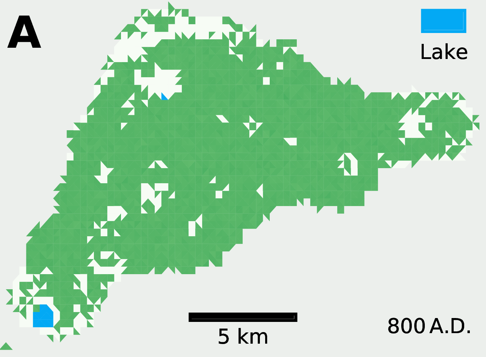

# Easter Island ABM
An Agent-Based Model that simulates the spatial and temporal dynamics of household agents on Easter Island and their interactions with a spatially explicit and realistic natural environment prior to European arrival.

Associated publication: [[Steiglechner and Merico (2022)]](#0)

<p align="center">
  
</p>

 For a video sample of the output of this model see `readme_pics/default_full_seed1.mp4`

## Model
### Motivation:
The history of Easter Island, with its cultural and ecological mysteries, has attracted the interests of archaeologists, anthropologists, ecologists, and economists alike. Despite the great scientific efforts, uncertainties in the available archaeological and palynological data leave a number of critical issues unsolved and open to debate. The maximum size reached by the human population before the arrival of Europeans and the temporal dynamics of deforestation are some of the aspects still fraught with controversies. By providing a quantitative workbench for testing hypotheses and scenarios, mathematical models are a valuable complement to the observational-based approaches generally used to reconstruct the history of the island.

### Short Summary:   
The ABM consists of multiple agents situated on a realistic representation of Easter Island's environment.
T The environment is encoded on a 2D discretised map with real geographic and orographic features. Agents are represented by households, which comprise a variable number of individuals. Households rely on two limited resources: (1) palm trees, considered here a primary, non-renewable resource for essential tools, firewood, building material, sugary sap, etc. and (2) cultivated sweet potatoes, which constituted an important source of carbohydrates and water on the island. Households use these resources by cutting trees and by creating gardens (i.e., cultivating cleared, arable land available in their immediate surrounding). The growth or decline of households depends on the success with which they can obtain these resources. Households adapt to the changing environment and to the growing population in three ways. First, a household splits into two when it becomes too large and one of the two relocates in a different place. Second, households relocate when resources become scarce in their current location. Their moving behaviour is determined by resource availability and certain features of the environment, including elevation and distance from the three major lakes (Rano Kau, Rano Raraku, and Rano Aroi). Third, in a response to the declining number of trees, households adapt their resource preference from a resource combination dominated by non-renewable trees to a combination dominated by stable cultivation of sweet potatoes.
    In summary, the interaction between agents and the natural environment and the adaptive response of agents, shape settlement patterns and population dynamics on the island.

In accordance with suggestions by [[Bahn and Flenley (2017)]](#1), the simulations start with two households (comprising a total population of 40 individuals) positioned in the proximity of Anakena Beach in the northern part of the island in the year 800 A.D., thus, mimicking the arrival of the first Polynesian settlers. Model updates occur asynchronously on time steps of one year until 1800 A.D..  
    The model does not include processes such as spreading of diseases or slavery that were introduced after the discovery of the island by European voyagers in the 18th century. 

<p align="center">
  
</p>

#### Environment
The environment is subdivided into Delaunay triangular cells. Cells are characterised by fixed orographic and geographic features (area, elevation, slope, and arability index (see panel B)) and variable amounts of resources (number of trees (see panel A) and number of gardens).

<p align="center">
  
  
</p>

 At the beginning of the simulation (800 A.D.), a total of 16 million trees are uniformly distributed on the map, covering 85% of the island. The classification of cells into 'well-suited' (100% yield), 'poorly suited' (5% yield), and 'not suited' (0% yield) for cultivating sweet potatoes is based on the agriculturally viable zones identified by [[Puleston et al. (2017)]](#2).

#### Agents
Agents are characterised by their locations (dots), their population size (dot size), and their resource preference (dot colour). The agent's surroundings (concentric circles) are defined by the tree harvest radius `r_T` and the cultivation radius `r_C` for cultivating gardens. 


## How to run the model

### Quickstart
Run
```
python main.py default fullyconstrained 1
```
Each simulation run will take about 5-10 minutes on a standard computer. 

The additional arguments to the main python script provide the corresponding, predefined parameter files in folder ```./params```.
These files contain dictionaries with the parameters for each specific experiment and scenario. 

- the first additional argument is the filename of parameter values for the different experiments tested in the 
    sensitivity analysis (folder params/sa/...):
        e.g. use ```default``` for /params/sa/default
- the second additional argument is the filename of parameter values for the specific scenario `unconstrained`, 
    `partlyconstrained`, or `fullyconstrained` (folder params/scenarios/...):
        e.g. use ```fullyconstrained``` for /params/scenario/fullyconstrained
- the third additional argument denotes the (integer) `seed` value used.

For a detailed description of the parameters, look at [Parameters](PARAMETERS.md).

### Output
The created folder `data/` with a subfolder denoting the chosen options specific for a simulation contains: 
- folder ```used_files``` that copies the python scripts used for this run
- netcdf file  ```dynamic_env.ncdf``` that includes (among others) number of individuals, trees, gardens in each environmental cell over all time steps.
- csv file  ```ags_stats.csv``` that includes for every time and every agent (existing at that time) the agent's location, its population size, its resource preference of harvesting trees over cultivating sweet potatoes, and the cells of its cultivated gardens.
- netcdf file  ```aggregate_values.ncdf``` includes further information aggregated over all agents in every time step (e.g.\ their mean satisfaction)
- netcdf file  ```const_map_values.ncdf``` includes constant features of the environment (like triangle positions, elevation, slope, arability index) of all cells.

### Ensemble Runs
Alternatively, to get the main results for all three scenarios `unconstrained,  `partlyconstrained, or `fullyconstrained with multiple seeds as used for our results section, 
Run the following command e.g.\ on a cluster
```
./run_scenarios.sh default
```
and unpack later on local machine
```
./unpack.sh data/packed/default_fullyconstrained_seed
```


## Files
- ```agents.py ```
    contains the Agent class
- ```main.py ```
    contains the Model class
- ```create_map.py```
    contains the class Map defining a discretised environment
- ```saving.py ```
    contains helper functions to save the model's state
- ```./Map/```
    This folder contains the maps used as inputs in the creation of the discretised map:
    - ```elevation_EI.tif```
    - ```slope_EI.tif```
    - ```puleston2017_original.jpg```
- ```./params```
    This folder contains python scripts that define dictionaries of parameters for 
    - several constant properties, 
    - several properties of the model that we used for a sensitivity analysis in the associated publication and
    - properties used in three model formulations presented in the main result section of the associated publication.
    
#### For Automated Ensemble Simulations
- ```run_scenarios.sh```
    Bash script to run all three scenarios
- ```run_ensemble.sh```
    Bash script to run multiple seeds for a given scenario
- ```unpack.sh```
    Bash script to unpack results from run_scenarios.sh
  
    
## Python Libraries and Dependencies

The code was tested with the following python packages: 

| Package  | Version |
|-----|-----|
| python | 3.8 |
| xarray | 0.16.1|
| scipy | 1.5.0 |
| numpy | 1.18.5 |
| matplotlib | 3.2.2 |
| pathlib | 1.0.1 |


## References and Further Reading
<a id="0">[0]</a>
Steiglechner, P., Merico, A. (2022). Spatio-Temporal Patterns of Deforestation, Settlement, and Land Use on Easter Island Prior to European Arrivals. In: Rull, V., Stevenson, C. (eds) The Prehistory of Rapa Nui (Easter Island). Developments in Paleoenvironmental Research, vol 22. Springer, Cham. https://doi.org/10.1007/978-3-030-91127-0_16

<a id="1">[1]</a>
Bahn P, Flenley J (2017) Easter Island, Earth Island: The enigmas of Rapa Nui, 4th edn. Rowman & Littlefield, Maryland, USA

<a id="2">[2]</a>
Puleston CO, Ladefoged TN, Haoa S, Chadwick OA, Vitousek PM, Stevenson CM
(2017) Rain, sun, soil, and sweat: A consideration of population limits on Rapa Nui (Easter Island) before European contact. Frontiers in Ecology and Evolution DOI 10.3389/fevo.2017.00069

<a id="3">[3]</a>
Rull, V. (2020), The deforestation of Easter Island. Biol Rev, 95: 124-141. https://doi.org/10.1111/brv.12556

# Author
Peter Steiglechner, April 2021. [Orcid Link](https://orcid.org/0000-0002-1937-5983)

