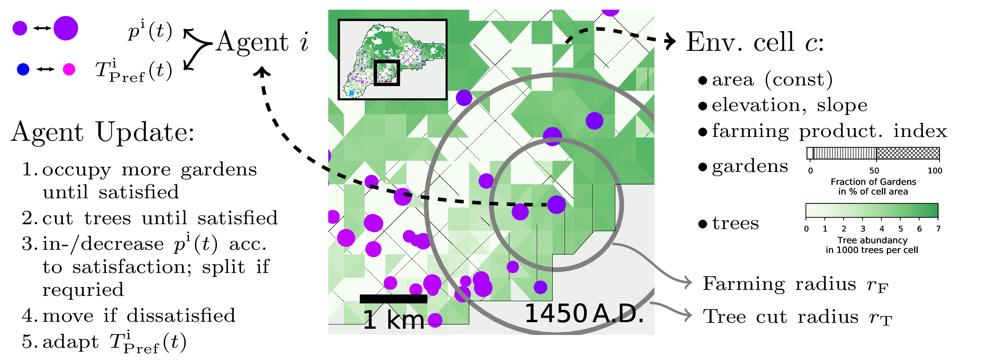
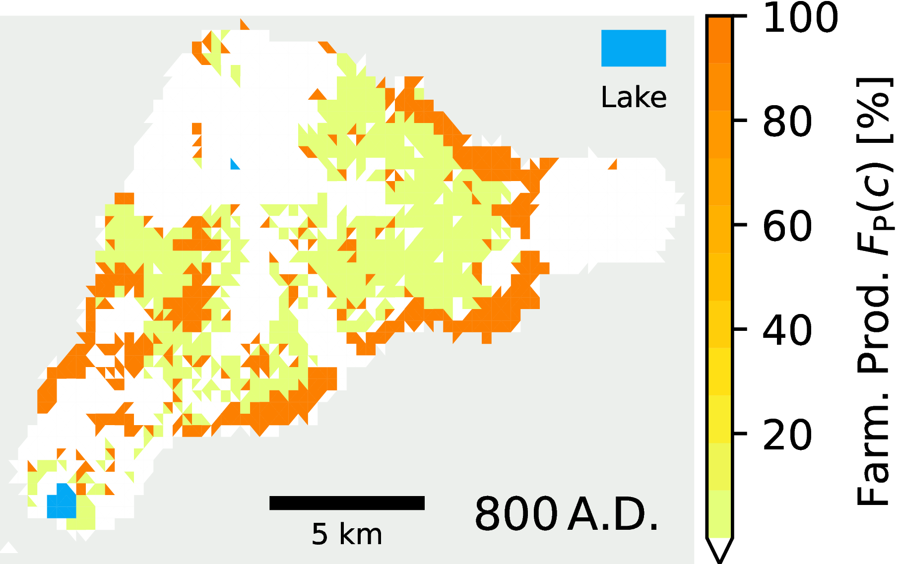
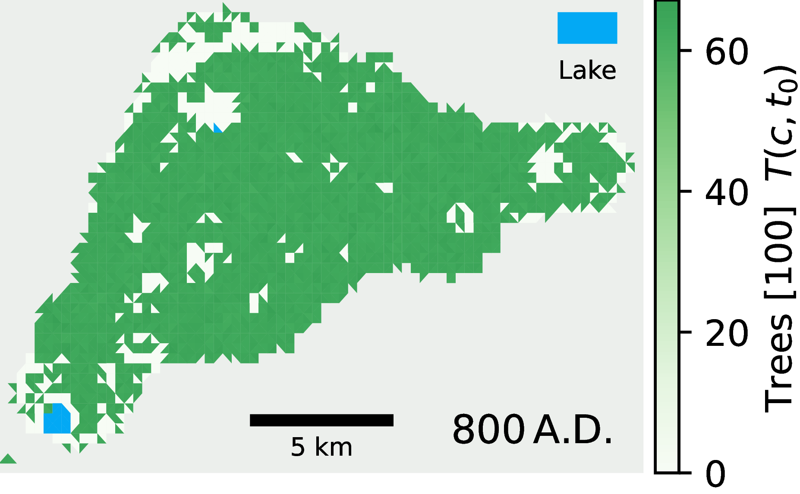

# Easter Island ABM
 An Agent-Based Model (ABM) that simulates the spatial and temporal dynamics of household agents on Easter Island
    and their interactions with the natural environment through resource consumption prior to European arrival.

## Model

<p align="center">
  
</p>


##### Short Summary:   
The ABM consists of multiple agents situated on a realistic representation of Easter Island's environment.
The environment is encoded on a 2D discretised map with heterogeneous geographic and
biological features. Agents represent households, who rely on two limited resources provided by this environment:
(1) Non-renewable palm trees (or derivate products like firewood, canoes or sugary sap e.g. [Bahn2017])
and (2) sweet potatoes. Agents obtain these resources by cutting trees and cultivating arable farming sites in
their near surroundings. Thereby, they change their local environment. The household's population growth or
decline consequently depends on the success of this resource acquisition. Furthermore, the resource availability
and other geographic indicators, like elevation or distance to freshwater lakes, determine the moving behaviour
of the agents on the island. The interaction with the natural environment, thus, constrains and shapes settlement
patterns as well as the dynamics of the population size of the Easter Island society.

##### Time in the Model
The simulation starts with two agents (with a total population of 40 individuals) settling in proximity to Anakena Beach in the North part of the island in the year 800 A.D., following [Bahn2017].
All agents are then updated in yearly time steps up to 1900 A.D..
With the growing impacts through voyagers arriving on Easter Island in the 18th and 19th centuries, deportations of inhabitants as slaves and introduction of new diseases, the prehistoric phase and the island's isolated status end.

##### Functions:
- init : initiate the model by setting constants and parameters, createing the map,
- run : run one simulation
- init_agents : initalise the n_agents_arrival agents
- observe : store agent's traits, state of the environment and aggregate variables for one time step
- step : proceed one time step
- P_cat : return the penalty following a logistic function of an evaluation variable for cells in a specified evaluation category.

See [ModelSection](md_docs/model_description.md) for more details.


## Agent
Household agents located on the island with a specific population, resource related attributes and an update procedure for each year.

##### State variables of the agent entity 
- Location (x, y, cell)
- Populatoin size p
- preference, t_pref, of resources tree over farming produce
- farming yield from occupied gardens and their farming productivity
- cut trees in the current year
- satisfaction with resource harvest.

##### Processes
- calc_resource_req : calculate resource requirement for current year from constant tree/farming requirement per person, farming/tree_req_pp, tree preference t_pref and population size p
- update_t_pref :  update the tree preference according to the level of deforestation in the local surrounding (with radius r_t).
- split_household : split household to form a new agent with population p_splitting_agent in a new location
- remove_agent : dissolve the agent, clear its land and remove all its individuals
- remove_unnecessary_gardens : if there is overproduce in farming, leave gardens (preferably poorly suited).
- population_change :  population growth/decline via a stochastic process for each individual to reproduce or die given the growth rate mu_mean from the past-dependent satisfaction index s
- mu_mean : return the mean growth rate given an agent's past-dependent satisfaction
- calc_penalty : calculate the penalty(ies) for cell(s) triangle_inds on the island based on weights on the specific evaluation criteria, alphas,and the current tree preference
- move : relocate the settlement according to stochastic process according to the total penalties of cells, within_inds
- occupy_gardens : occupy more gardens (preferably, well suited and with fewest trees needed to be cleared) in radius r_F until requirement f_req fulfilled or no further unoccupied gardens available in r_F.
- harvest_trees : cut trees in radius r_t until requirement fulfilled or no further trees available in radius r_t.
- update : update procedure of harvesting, population adaptation and potential moving for the agent in each time step


See [AgentSection](md_docs/agent_description.md) for more details.

## Environment
Discretised representation of the map of Easter Island.

<p align="center">
  
  
</p>

#### Idea:
Obtain an elevation map of a rectangular extract of Easter Island. Each pixel represents the elevation at the particular point.
Here, we obtain this from Google Earth Engine.
Define a grid of points within the map.
Define triangular cells in this grid.
Each cell is a microscopic unit of the discretised representation.
A cell has the following constant properties:
- elevation
- slope
- corresponding geography penalty.
- midpoint
- Area
- farming productivity index
- number of available well and poorly suited gardens
- tree carrying capacity (or trees at time of arrival)

A cell has additionally dynamic properties:
- trees
- area-weighted distance to freshwater lake / water penalty which depends on the droughts
- population
- number of trees cleared
- number of occupied gardens

additionally a cell can be:
- on land or ocean
- the cell of anakena beach,
- part of a freshwater lake
- a coastal cell


##### Implementation details:
Static Variables:
- triobject : consisting of the matplotlib.triangulation object
    - x : coordinate of points in km
    - y : coordinate of points in km
    - triangles : the indices of the three corner points for each triangular cell
    - mask : denoting those triangles not on the ocean, i.e.\ where the midpoint has a non-zero elevation
- el_map : elevation on each cell in m above sea level
- sl_map : map of slope on each cell in degrees
- f_pi_c : the farming productivity index (f_pi_well for well suited and f_pi_poor for poorly suited, 0 else) for each cell
- trees_cap : number of trees in each cell before arrival of the first settlers, thus carrying capacity
- avail_well_gardens : Number of potential well-suited gardens in each cell determined by the area of a cell and the size of a garden
- avail_poor_gardens : Number of potential well-suited gardens in each cell determined by the area of a cell and the size of a garden

Dynamic Variables:
- water_cells_map : indices of cells containing water
- penalty_w : Penalty [0,1] for each cell depending on the distance to freshwater lakes, which depends on wether Rano Raraku is dried out.
- occupied_gardens : dynamic number of occupied gardens in each cell
- pop_cell : population in each cell
- tree_clearance : number of cleared trees in each cell
- trees_map : number of available trees in each cell.

The class needs:
- an elevation image (with a latitude and longitude bounding box)
- a slope image (with the same bounding box)
- Figure 4 of [Puleston2017], giving farming producitivity indices (with a longitude and latitude bounding box)

See [MapSection](md_docs/map_description.md) for more details.

## Parameters for the results

### Constants

| Variable | Value | Note |
|-----|-----|-----|
| n_agents_arrival | 2 | |
| p_arrival | 40 | population at arrival |
| time_end | 1900 | A.D.|
| moving_radius_arrival | 1 | km; after arrival, settlers remain close to Anakena Beach |
| droughts_rano_raraku | [[800, 1200], [1570, 1720]] | start and end years of droughts at Rano Raraku |
| f_pi_well | 1 | relative farming productivity index of well suited cells|
| f_pi_poor | 0.05 | relative farming productivity index of poorly suited cells|
| garden_area_m2 | 1000 | size of a garden in m^2 |
| gridpoints_y | 50 | number of gridpoints covering the rectangular map |
| gridpoints_x | 75 | number of gridpoints covering the rectangular map |
| n_trees_arrival | 16000000.0 | nr of trees at arrival |
| t_pref_max | 0.8 | maximum tree preference |
| t_pref_min | 0.2 | minimum tree preference |
| p_splitting_agent | 12 | individuals of a new agent after it splits from an existing |
| p_remove_threshold | 6 | minimum population size of an agent, below this threshold the agent is removed |
| satisfaction_equ | 0.68844221 | Satisfaction index at which the mean growth rate is 1; adopted from [Puleston2017] |
| evaluation_thresholds | see below | thresholds for 1% penalt and 99% penalty for the evaluation criterion in each cell and category | 
| alpha | see below | weights of each category in the decision about moving to a new location |


Alpha

| Freshwater distance w | Geography g | Pop Dens pd | Trees tr | Farming availability f | 
 |-----|-----|-----|-----|-----|
| 0.2 | 0.2 | 0.2 | 0.2 | 0.2 |

Evaluation Thresholds

| w01 | w99 | el01 | el99 | sl01 | sl99 | pd01 | pd99 | tr01 | tr99 | f01 | f99 |
|-----|-----|-----|-----|-----|-----|-----|-----|-----|-----|-----|-----|
| 2.8 (a) | 275.4 (b) | 0 | 300 | 0 | 7.5 | 0 | 300 | 0 | (c) | 0 | (d) |

(a):  (0.5 km)^2 / (pi * rad_raraku^2)
(b): (5 km)^2 / (pi * rad_raraku^2)
(c): ag.t_pref * t_req_pp * ag.p * satisfaction_equ
(d): (1-ag.t_pref) * f_req_pp * ag.p * satisfaction_equ


### Parameters for sensitivity analysis

| Variable | Value | Note |
|-----|-----|-----|
| t_req_pp | 10 | required trees per person per year (for t_pref = 1) |
| f_req_pp | 6.79 | required farmed gardens (weighted by farming productivity) per person (for t_pref = 0) |
| time_arrival | 800 | A.D.; arrival of settlers |
| max_p_growth_rate | 1.007 | maximum mean growth rate of an agent (for satisfaction = 1) |
| map_tree_pattern_condition | max_el: 450 | maximum elevation for trees in a cell |
|  | max_sl: 10 | maximum slope for trees in a cell |
|  | tree_decrease_lake_distance: 0 | decreas of tree density with area-weighted distance to freshwater lakes. (0 means uniform distribution) |


### Parameters for differrent scenarios

| Variable | Aggregate | Homogeneous | Constrained | Full | Description |
|-----|-----|-----|-----|-----|-----|
| n_agents_arrival | 1 | 2 | 2 | 2 |  number of initial agents
| p_split_threshold | infinity |  36 | 36 | 36 |  population size that triggers the splitting of an agent |
| r_t | infinity | infinity |  2 | 2 | km; radius for tree harvest |
| r_f |  infinity | infinity |  1 | 1 | km; radius for farming gardens |
| gamma | 0 | 0 | 0 | 0 | 20 | importance of penalties in decision making on new settlement location |


## How to run the model
Run the main script by providing files containing dicts with the parameters for the specific experiment 
and scenario (they need to match the file names in folders 'params/sa/' and 'params/scenarios') and the seed:
```
python main.py default full 1
```
Each run will take about 5-10 minutes on a standard computer. 

Alternatively, to get the main results in the results section run (e.g.\ on a cluster and unpack later on local machine)
```
./run_scenarios.sh default
```
```
./unpack.sh data/packed/default_full_seed
```
Run the analysis like ("default" is the model variant, "10" is the y_max of the island-wide population axis:
```
cd plot_functions
./plot_analysis.sh default 10
```

## Files
agents.py 
contains the Agent class

main.py 
contains the Model class

create_map.py
contains the Environment in class Map

saving.py 
contains helper functions to save the model's state

./Map/
This folder contains the maps used as inputs in the creation of the discretised map:
- elevation_EI.tif
- slope_EI.tif
- puleston2017_original.jpg

./plot_functions
This folder contains some scripts to reproduce the figures in the publication

./params
This folder contains python scripts that contain dicts of parameters for the constant parameters, the ones coresponding to the senstivity analysis in the publication and the scenarios presented in the main Result section.

## Python Libraries 

| Package  | Version |
|-----|-----|
| python | 3.8 |
| xarray | 0.16.1|
| scipy | 1.5.0 |
| numpy | 1.18.5 |
| matplotlib | 3.2.2 |
| pathlib | 1.0.1 |


## Further Reading

[Bahn2017] Bahn P, Flenley J (2017) Easter Island, Earth Island: The enigmas of Rapa Nui, 4th
edn. Rowman & Littlefield, Maryland, USA

[Puleston2017] Puleston CO, Ladefoged TN, Haoa S, Chadwick OA, Vitousek PM, Stevenson CM
(2017) Rain, sun, soil, and sweat: A consideration of population limits on Rapa Nui (Easter Island) before European contact. Frontiers in Ecology and Evolution
DOI 10.3389/fevo.2017.00069

